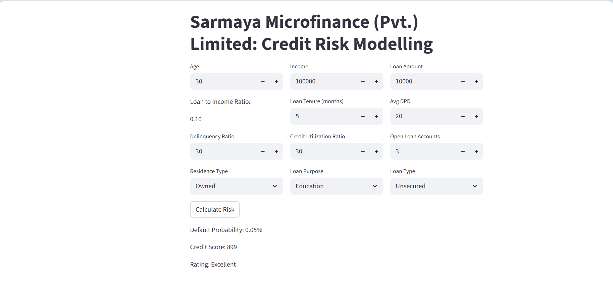

# 📊 Credit Risk Modeling

A machine learning web application that predicts the **probability of loan default** and generates a **credit score (300–900)** for loan applicants — built for **Sarmaya Microfinance (Pvt.) Limited**.

The project covers the full ML lifecycle: data cleaning, exploratory data analysis, feature engineering, model training (with class imbalance handling), hyperparameter tuning, and deployment via a Streamlit web app.

---

## 🖥️ App Screenshot



---

## ✨ Key Features

- **Default Probability Prediction** — Logistic Regression model trained on real-world microfinance data
- **Credit Score Generation** — Scaled to the standard 300–900 range (Poor / Average / Good / Excellent)
- **Interactive Web App** — Built with Streamlit; accepts 11 borrower inputs and returns instant results
- **End-to-End Notebook** — 125-cell Jupyter notebook covering EDA, feature engineering, WOE/IV analysis, VIF, SMOTE-Tomek, and Optuna tuning
- **Production-Ready Artifacts** — Pre-trained model, scaler, and feature list saved via `joblib`

---

## 🛠️ Technologies Used

| Category | Tools |
|---|---|
| Language | Python 3.12 |
| Web Framework | Streamlit |
| ML & Modeling | Scikit-learn, XGBoost, Imbalanced-learn, Optuna |
| Data Processing | Pandas, NumPy, SciPy |
| Visualization | Matplotlib, Seaborn |
| Model Persistence | Joblib |

---

## 📁 Project Structure

```
credit-risk-modeling/
│
├── app/
│   ├── main.py                  # Streamlit web application
│   └── prediction_helper.py     # Input preprocessing & credit score logic
│
├── artifacts/
│   └── model_data.joblib        # Saved model, scaler, and feature list
│
├── dataset/
│   ├── customers.csv            # Customer demographic data
│   ├── loans.csv                # Loan transaction data
│   └── bureau_data.csv          # Credit bureau data
│
├── notebooks/
│   └── credit_risk_modeling.ipynb  # Full ML pipeline notebook
│
├── screenshots/
│   └── app_screenshot.png       # App UI screenshot
│
├── requirements.txt             # Python dependencies
├── .gitignore                   # Git ignore rules
└── README.md                    # Project documentation
```

---

## ⚙️ Installation & Setup

### 1. Clone the Repository

```bash
git clone https://github.com/moaz-dev1/credit-risk-modeling.git
cd credit-risk-modeling
```

### 2. Create a Virtual Environment

```bash
python -m venv .venv

# Windows
.venv\Scripts\activate

# macOS / Linux
source .venv/bin/activate
```

### 3. Install Dependencies

```bash
pip install -r requirements.txt
```

---

## 🚀 How to Run

```bash
cd app
streamlit run main.py
```

Then open your browser at **http://localhost:8501**

> **Note:** The app loads the pre-trained model from `artifacts/model_data.joblib`. Make sure the working directory is the project root, or adjust the `MODEL_PATH` in `prediction_helper.py` accordingly.

---

## 📓 Notebook Walkthrough

Open the full ML pipeline notebook:

```bash
jupyter notebook notebooks/credit_risk_modeling.ipynb
```

The notebook covers:

1. **Data Loading** — 3 datasets: customers, loans, bureau data
2. **Train/Test Split** — Done before EDA to prevent data leakage
3. **Data Cleaning** — Missing values, duplicates, outlier removal
4. **EDA** — KDE plots, box plots, categorical analysis
5. **Feature Engineering** — Loan-to-Income ratio, Delinquency Ratio, Avg DPD per Delinquency
6. **Feature Selection** — VIF (multicollinearity), WOE & IV (categorical features)
7. **Model Training**
   - Attempt 1: Logistic Regression, Random Forest, XGBoost (no imbalance handling)
   - Attempt 2: Undersampling
   - Attempt 3: SMOTE-Tomek + Optuna hyperparameter tuning ✅ Final model
8. **Deployment** — Saved model artifacts → Streamlit app

---

## 🔮 Future Improvements

- [ ] Add SHAP explainability dashboard to show feature contribution per prediction
- [ ] Support batch prediction via CSV file upload
- [ ] Add model retraining pipeline with new data ingestion
- [ ] Containerize the app with Docker for cloud deployment
- [ ] Integrate with a database to log predictions over time
- [ ] Add authentication layer for enterprise use

---

## 👤 Author

**Moaz**  
📧 [moaz.dev1@gmail.com](mailto:moaz.dev1@gmail.com)  
🔗 [LinkedIn](https://www.linkedin.com/in/moaz) · [GitHub](https://github.com/moaz-dev1)

---

## 📄 License

This project is for educational and portfolio purposes.
